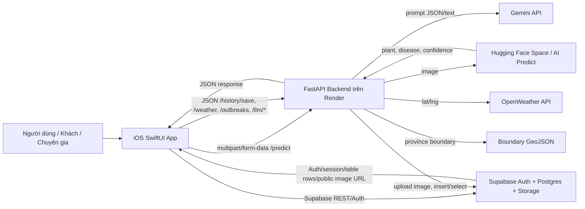
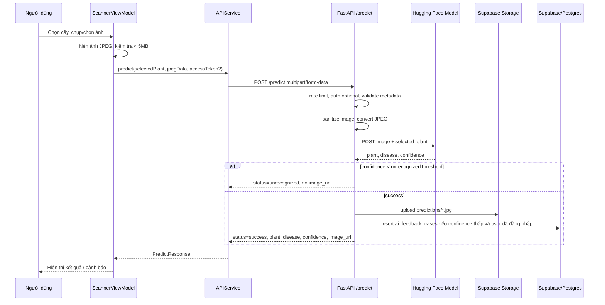
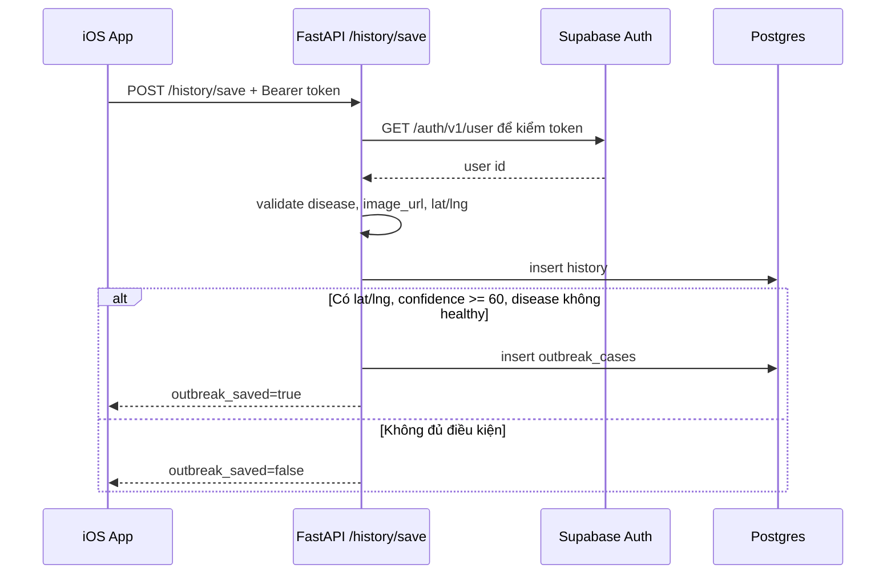
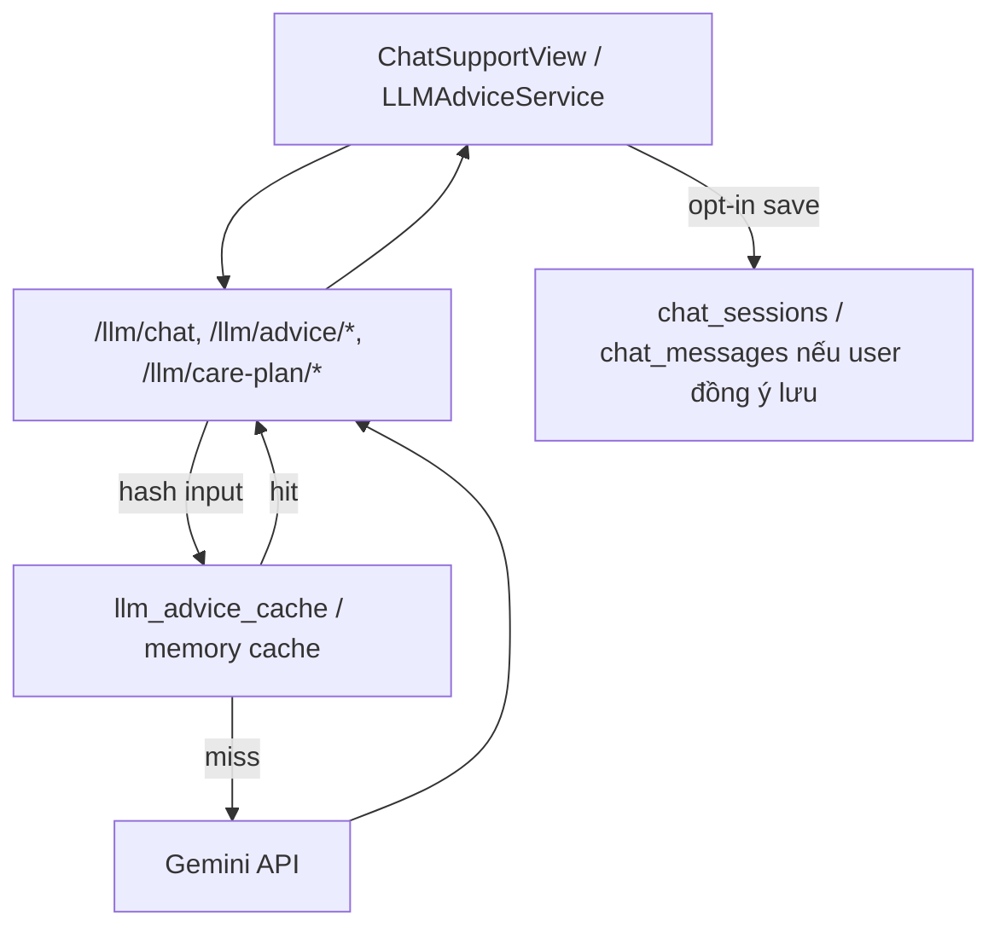
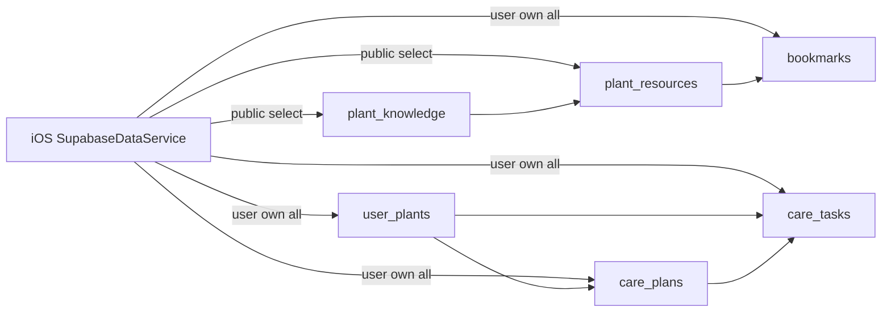

# Bản đồ tổng quan kiến trúc hệ thống Plant Disease Detector

Tài liệu này mô tả hệ thống ở mức kiến trúc và luồng dữ liệu. Mục tiêu là giúp nhìn được toàn bộ đường đi của dữ liệu từ giao diện iOS đến backend, Supabase, AI model và các dịch vụ ngoài.

## 1. Kiến trúc tổng quan

## 2. Ba lớp chính của đồ án

### 2.1. Lớp giao diện iOS

Các file chính:

- `PlantDiseaseDetector(IOS)/PlantDiseaseDetector/PlantDiseaseDetectorApp.swift`
- `PlantDiseaseDetector(IOS)/PlantDiseaseDetector/Features/Auth/RootView.swift`
- `PlantDiseaseDetector(IOS)/PlantDiseaseDetector/Features/Scanner/ScannerView.swift`
- `PlantDiseaseDetector(IOS)/PlantDiseaseDetector/Features/Scanner/ScannerViewModel.swift`
- `PlantDiseaseDetector(IOS)/PlantDiseaseDetector/Services/APIService.swift`
- `PlantDiseaseDetector(IOS)/PlantDiseaseDetector/Services/SupabaseDataService.swift`
- `PlantDiseaseDetector(IOS)/PlantDiseaseDetector/Services/LLMAdviceService.swift`
- `PlantDiseaseDetector(IOS)/PlantDiseaseDetector/Services/WeatherService.swift`
- `PlantDiseaseDetector(IOS)/PlantDiseaseDetector/Services/OutbreakService.swift`

Vai trò:

- Hiển thị giao diện.
- Lấy ảnh từ camera/thư viện.
- Gửi ảnh lên backend.
- Gọi Supabase Auth/REST để đăng nhập, lưu cây, bookmark, chat, phản hồi.
- Hiển thị lịch sử, bản đồ vùng dịch, thời tiết, tư vấn AI.

### 2.2. Lớp backend FastAPI

Các file chính:

- `main.py`
- `deploy/main.py`
- `deploy/config.py`
- `deploy/security.py`
- `deploy/auth.py`
- `deploy/routers/predict.py`
- `deploy/routers/history.py`
- `deploy/routers/llm.py`
- `deploy/routers/weather.py`
- `deploy/routers/outbreaks.py`
- `deploy/routers/consultations.py`
- `deploy/database.py`
- `deploy/gemini.py`
- `deploy/validation.py`
- `deploy/rate_limit.py`

Vai trò:

- Nhận request từ iOS.
- Chặn request sai định dạng, quá lớn, vượt rate limit.
- Xác thực bearer token Supabase khi endpoint cần đăng nhập.
- Xử lý ảnh upload và gọi Hugging Face.
- Ghi lịch sử, cache LLM, vùng dịch vào Supabase/Postgres.
- Gọi Gemini, OpenWeather, dữ liệu boundary.

### 2.3. Lớp dữ liệu Supabase

Các file chính:

- `supabase/README.md`
- `supabase/sql/003_profiles_roles.sql`
- `supabase/sql/011_ai_feedback_cases.sql`
- `supabase/sql/013_chat_consent_sessions.sql`
- `supabase/sql/014_care_plants_tasks.sql`
- `supabase/sql/015_plant_knowledge_resources.sql`
- `supabase/sql/017_storage_plant_images.sql`
- `supabase/sql/021_outbreak_cases_diagnosis_links.sql`
- `supabase/sql/024_user_plants_current_diagnosis.sql`
- `supabase/sql/025_chat_message_attachments.sql`
- `supabase/sql/026_consultation_photos_and_feedback_admin.sql`
- `supabase/sql/027_profiles_account_metadata.sql`

Vai trò:

- Auth: quản lý tài khoản, token, Google OAuth.
- Postgres: lưu hồ sơ, lịch sử, feedback, chat, cây của tôi, bookmark.
- Storage: lưu ảnh chẩn đoán, ảnh feedback/retrain, ảnh tư vấn.
- RLS: đảm bảo user chỉ thao tác dữ liệu của mình, expert mới được duyệt/cập nhật workflow.

## 3. Luồng chẩn đoán bệnh cây

## 4. Luồng lưu lịch sử và tạo vùng dịch

## 5. Luồng Supabase RLS dễ hiểu

Ví dụ đời thường: Supabase giống một tòa nhà chung cư.

- `auth.users`: danh sách cư dân.
- `profiles`: thẻ cư dân ghi vai trò user/expert.
- RLS là bảo vệ ở cửa từng phòng.
- User thường chỉ mở được phòng của mình.
- Expert có thẻ đặc biệt nên xem/cập nhật được các phòng cần thẩm định.
- Service role key là chìa khóa tổng của ban quản lý, chỉ backend giữ, tuyệt đối không đưa vào app.

## 6. Luồng chatbot và LLM

## 7. Luồng Discover, Bookmark, Cây của tôi

## 8. Git hiện tại khi lập tài liệu

Khi đọc repo, trạng thái git có:

- `PlantDiseaseDetector(IOS)` có trạng thái modified theo git parent.
- `supabase/sql/025_chat_message_attachments.sql` và `supabase/sql/026_consultation_photos_and_feedback_admin.sql` đang bị xóa vài dòng comment.
- `supabase/sql/027_profiles_account_metadata.sql` là file SQL mới chưa commit.

Không có thay đổi code ứng dụng nào được thực hiện trong quá trình tạo tài liệu học này.

